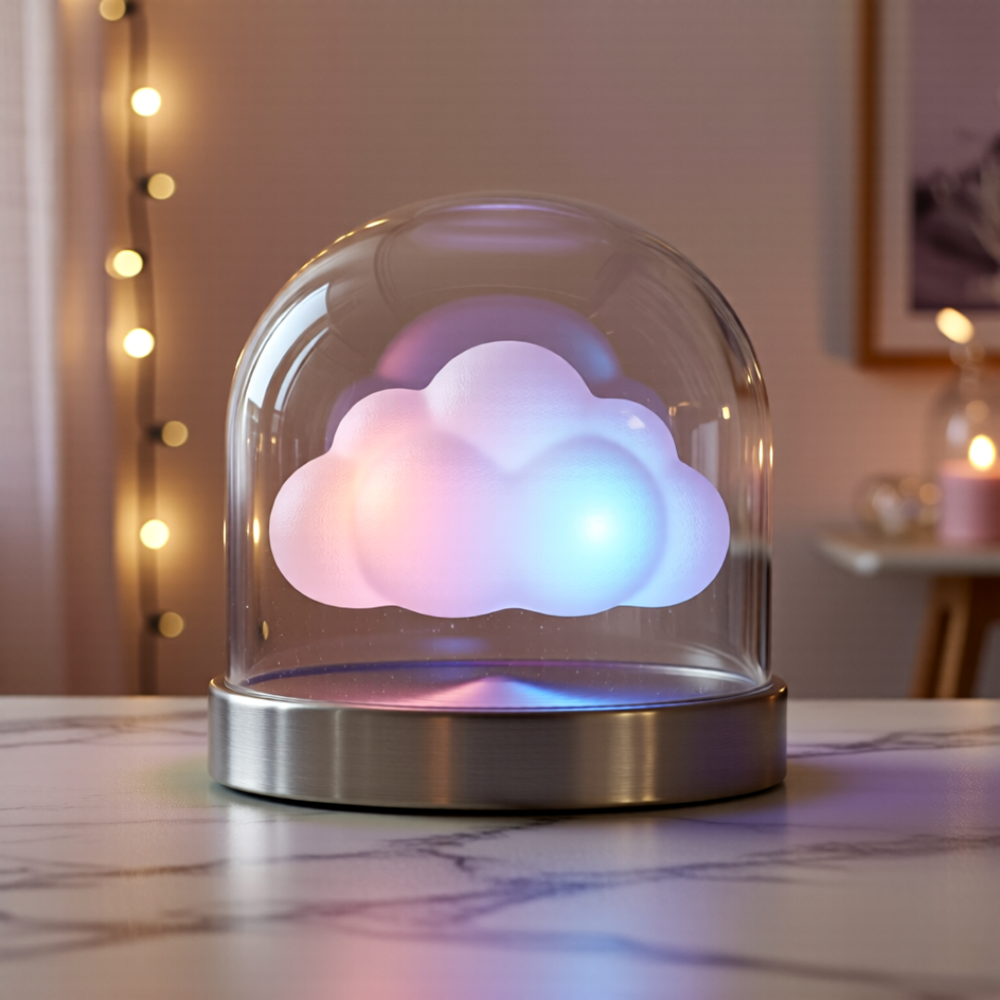

# 2026 PIIX Contest - 대상 수상작

## 🏆 수상 내역
- **수상:** 대상
- **증빙 자료:** [상장 (블라인드 처리됨)](./픽스콘테스트_대상(name_blinded).pdf)
- **대회 홈페이지:** [PIIX Contest](https://piix.studio/contest?id=1)
- **대회 설명:** [공식 노션 링크](https://www.notion.so/2026-32786836bc5780c5818dd2df71ce385d?source=copy_link)

## 💡 작품 소개 (제품 설명)
**마음의 날씨를 기록하는 구름 무드등**

* **컨셉: 감정 회고 무드등 Cloud-I**
  바쁜 일상 속 '나'를 잃지 않도록 하루의 감정을 회고하는 무드등을 기획했습니다. 
  유리 돔 속 구름은 그날의 기분에 따라 색이 변하며, 우울한 날 뒤엔 찬란한 무지개 빛을 띄워 "비 온 뒤엔 맑아진다"는 위로를 전합니다.

* **표현**
  몽글몽글한 솜사탕 질감의 구름과 투명한 유리의 대비, 은은한 오로라 조명으로 따뜻하고 몽환적인 치유의 감성을 시각화했습니다. 
  2026년은 성취만큼 내면의 건강도 챙기는 한 해가 되길 바랍니다.

## 🖼 제출 이미지

## 🛠 생성 팁 및 작업 과정
1. 색감이나 컨셉 등을 먼저 설명하여 목표로 하는 객체가 확실하게 생성된 이미지를 10장 정도 생성합니다.
2. 해당 이미지들을 최소 3장 포함하여 베이스 이미지로 설정하고, 제품설명을 그대로 생성 프롬프트로 잡습니다.
3. 객체는 확실히 생성되었고 디테일이나 미감을 확보하는 것이 목적이기 때문에, 베이스 이미지를 반영하는 %는 최소 80으로 잡습니다.
4. 이 과정을 반복하여 원하는 결과물을 도출합니다.
